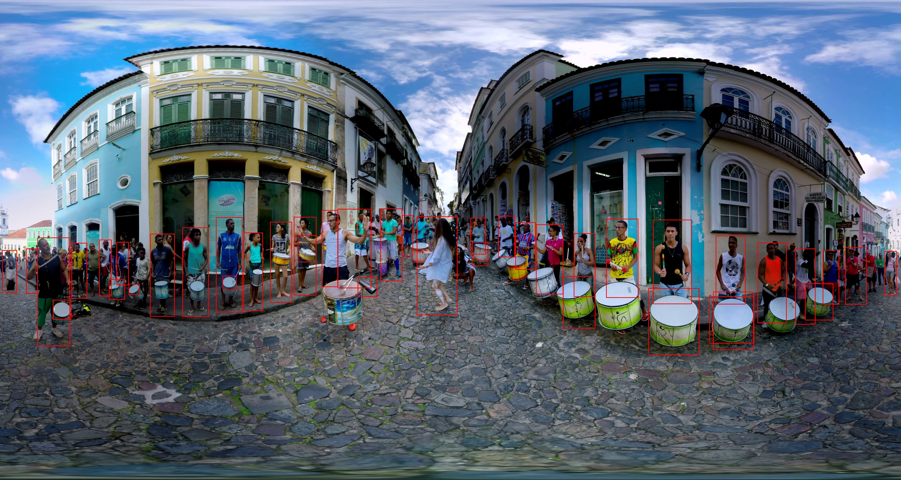

# 360° Object-Recognition-in-High-Resolution-360-Panoramic-Images-Using-Spherical-Grids


## Overview

This project aims to perform object detection in high-resolution 360° panoramic images using custom-trained VGG16 models and pretrained YOLOv8 models. The solution is designed to handle both classification and bounding box detection on complex images, making it versatile for real-world applications. The implementation supports two main modes:

1. **Custom VGG16 Training**: Train a VGG16 model for object classification and bounding box detection using your custom dataset.
2. **YOLOv8 Inference**: Utilize the state-of-the-art YOLOv8 model for object detection on 360° images with high accuracy.

## Features

- **Custom VGG16 Implementation**: Offers flexibility to train a VGG16 model from scratch on a dataset of choice, providing a tailored solution for specific object detection tasks.
- **Pretrained YOLOv8 Integration**: Leverage a pretrained YOLOv8 model to perform object detection on 360° images with high accuracy.
- **360° Image Compatibility**: The project handles high-resolution equirectangular images, making it suitable for use cases in virtual reality, real estate, or autonomous navigation.
- **Bounding Box and Classification Support**: The solution provides bounding box predictions along with class labels, ensuring comprehensive object detection capabilities.
- **Visualization and Evaluation**: In-built functions for visualizing results and evaluating model performance using standard metrics such as IoU, Precision, Recall, and F1 Score.

## Requirements

The project requires the following dependencies, which can be installed using `requirements.txt`:

```bash
pip install -r requirements.txt
```

- TensorFlow 2.x
- Keras
- OpenCV
- Matplotlib
- NumPy
- Pandas
- Scikit-learn
- Pytorch
- torchvision
- ultralytics

## Directory Structure

The project is organized as follows:

```
├── dataset/
│   ├── images/                 # Contains training and testing images
│   ├── labels/                 # Contains YOLO format labels (class, center_x, center_y, width, height)
├── pretrained_models/          # Contains pretrained YOLOv8 and VGG16 models
├── output/                     # Output folder for storing evaluation results and images
├── 1_train_VGG_16.py           # Script for training VGG16 model
├── 2_metric_evaluation.py      # Script for evaluating model performance
├── config.py                   # Configuration file for dataset paths and hyperparameters
├── prediction_equirectangular.py # Script for performing predictions on 360° images
├── README.md                   # Project documentation
├── requirements.txt            # Required libraries and dependencies
```

## Usage

### 1. Training Custom VGG16 Model

The VGG16 model can be trained from scratch using the custom dataset organized in YOLO format. To begin training:

```bash
python 1_train_VGG_16.py
```

The script automatically handles the loading, preprocessing, and training of the VGG16 model. Users can adjust the configuration options such as learning rate, batch size, and number of epochs in `config.py`.

### 2. Model Evaluation

Once the model is trained, evaluate its performance using:

```bash
python 2_metric_evaluation.py
```

The evaluation script will calculate standard metrics including Intersection over Union (IoU), Precision, Recall, F1 Score, and Accuracy. Results will be saved in the `output/` directory.

### 3. Prediction on 360° Images

For predicting objects on equirectangular 360° images using the pretrained YOLOv8 model:

```bash
python prediction_equirectangular.py --image /path/to/your/image.jpg
```

This script loads a 360° panoramic image, divides it into perspective views, and performs object detection. Detected objects are mapped back to the original 360° image for comprehensive visualization.

## Configuration

The configuration file `config.py` contains all parameters required for training and evaluation:

- **Dataset Paths**: Define paths for images and labels.
- **Hyperparameters**: Set learning rate, batch size, and number of epochs.
- **Model Parameters**: Choose between training from scratch or using a pretrained model.

## Results

Results of training, evaluation, and prediction will be stored in the `output/` directory. This includes the trained model, evaluation metrics, and images with bounding boxes and class labels.

## Contributions

This project is based on research work that is currently under review for publication. It introduces a novel approach to object detection in high-resolution 360° panoramic images. If you use this project or the concepts presented here, please consider citing the following article once published:

**Title**: Object Recognition in High-Resolution 360° Panoramic Images Using Spherical Grids  
**Authors**: Federico Candela, et al.  
**Publication**: 4th International Conference on Electrical, Computer, Communications and Mechatronics Engineering (ICECCME)

## Contributing

Contributions to this project are welcome. If you find any issues or have suggestions, feel free to create a pull request or submit an issue.
